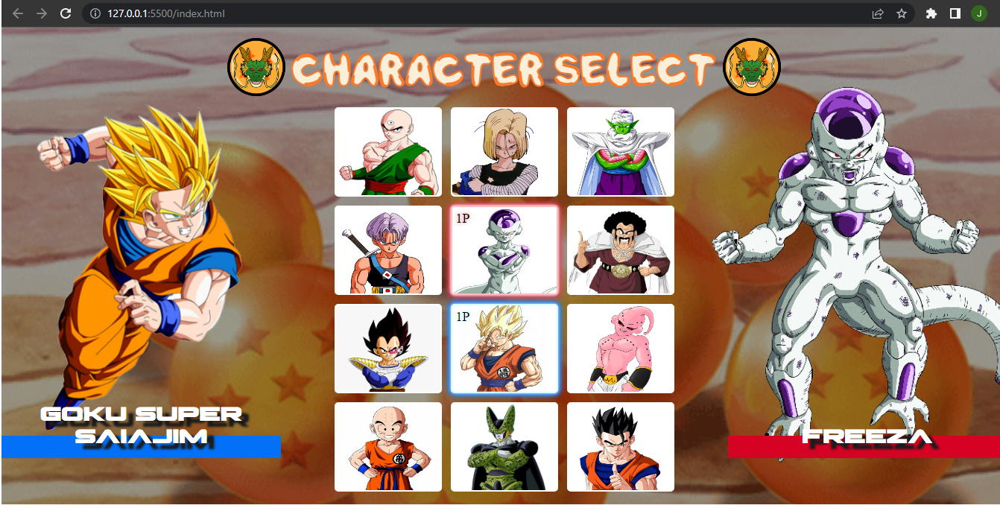

# Projeto Dragon Ball Z

### Projeto simulando a escolha de um jogo de video game com os personagens do desenho animado Dragon Ball Z. Projeto realizado junto ao canal Dev Em Dobro com os devs Ricardo e Roberto. Com intuito de exercitar os fundamentos do desenvolvimento web front end e aperfeiçoando os fundamentos de responsividade.

## Tecnologias

Esse projeto foi desenvolvido com as seguintes tecnologias:

- HTML
- CSS
- JavaScrip

### Confira o resultado final acessando https://johnerick-dev.github.io/projeto-dragon-ball-mapa-dev-week/

## Visualização do site

## Demonstrando responsividade

